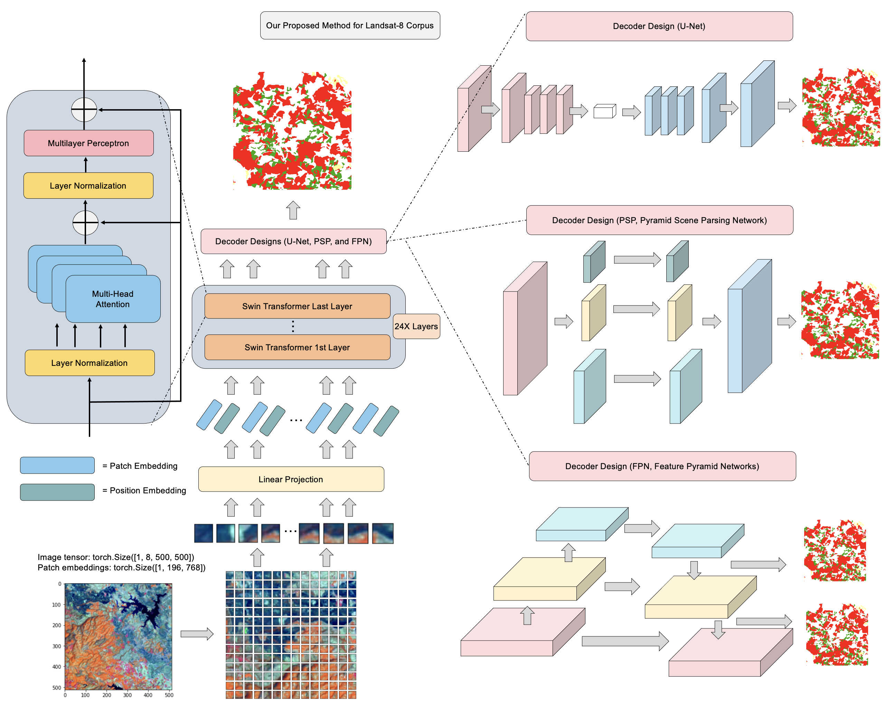
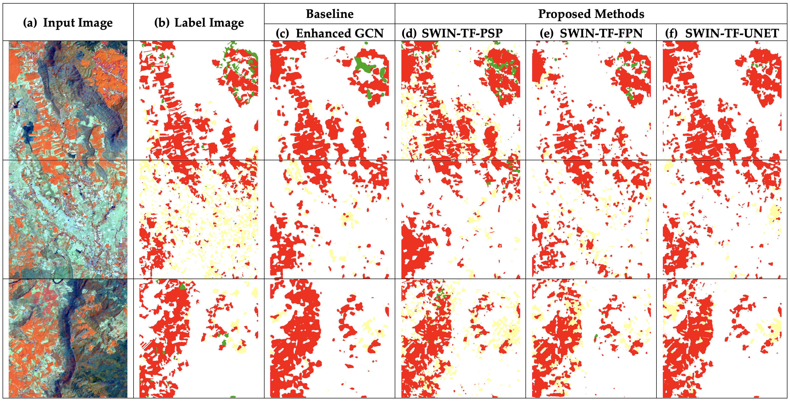
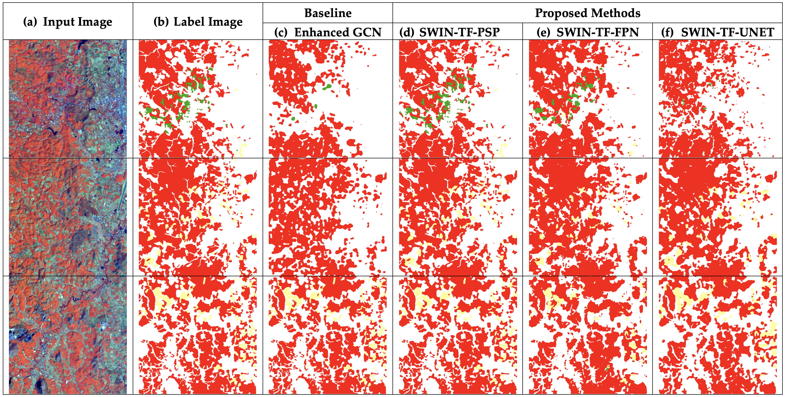

# Transformer-Based Decoder Designs for Semantic Segmentation on Remotely Sensed Images

**Author:** Teerapong Panboonyuen

---

## Overview

This repository presents cutting-edge decoder architectures integrated with Transformer networks for semantic segmentation of remotely sensed images. Building upon my prior research in remote sensing and deep learning, this work explores novel decoder designs that significantly enhance segmentation accuracy and robustness.

---

## Previous Works

I have contributed extensively to semantic segmentation in remote sensing, including:

1. **Semantic Labeling in Remote Sensing Corpora Using Feature Fusion-Based Enhanced Global Convolutional Network with High-Resolution Representations and Depthwise Atrous Convolution**
   *Remote Sens.*, 2020, 12, 1233
   [DOI](https://doi.org/10.3390/rs12081233)

2. **Semantic Segmentation on Remotely Sensed Images Using an Enhanced Global Convolutional Network with Channel Attention and Domain Specific Transfer Learning**
   *Remote Sens.*, 2019, 11, 83
   [DOI](https://doi.org/10.3390/rs11010083)

3. **Road Segmentation of Remotely-Sensed Images Using Deep Convolutional Neural Networks with Landscape Metrics and Conditional Random Fields**
   *Remote Sens.*, 2017, 9, 680
   [DOI](https://doi.org/10.3390/rs9070680)

---

## Key Contributions

* Introduced novel Transformer decoder designs tailored for semantic segmentation tasks in remote sensing.
* Leveraged pretrained Swin Transformer backbones enhanced with EfficientNet and domain-specific transfer learning.
* Provided a comprehensive set of pretrained checkpoints for seamless transfer learning.
* Delivered end-to-end training and inference pipelines with extensive augmentation and customization options.

---

## Visual Overview

<p align="center">

</p>

<p align="center">

</p>

---

## Updates

* **Oct 31, 2021:** Fixed bugs and updated all pretrained checkpoints.
* **Upcoming:** Full source code release post-publication of the latest article.

---

## 1. Pretrained Models & Checkpoints

Pretrained Swin Transformer (SwinTF) models integrated with decoder designs are available:

* **Trained with HR-GCN-FF-DA Network**

| Dataset & Model                     | Download Link                                                                      |
| ----------------------------------- | ---------------------------------------------------------------------------------- |
| SwinTF-FPN (ISPRS Vaihingen)        | [Google Drive](https://drive.google.com/open?id=1J7YClrBRlm9Oo8c8Xq621N_J0B_RYW2d) |
| SwinTF-PSP (Isan, Thailand Corpus)  | [Google Drive](https://drive.google.com/open?id=1kWWoQwSZx73e_lWElNT2Yebax4xU5FmB) |
| SwinTF-PSP (North, Thailand Corpus) | [Google Drive](https://drive.google.com/open?id=1WtqrrIC4-_5aQwMsUqgpjZQ3Kyk4t1PK) |

---

## 2. Getting Started

### Installation

Ensure you have the following dependencies installed:

```bash
pip install --upgrade tensorflow-gpu
sudo apt-get install python-opencv
```

### Directory Structure

Organize your dataset as follows:

```
corpus_name/
├── train/
├── train_labels/
├── val/
├── val_labels/
├── test/
├── test_labels/
```

Place a class-color mapping file named `our_class_dict.csv` inside your dataset folder. Example for Landsat-8w5c:

```csv
name,r,g,b
Agriculture or Harvested area,255,255,155
Forest,56,168,0
Urban,255,0,0
Water,0,122,255
Miscellaneous,183,140,31
```

### Running Training & Inference

* `train.py` — Train your model on the specified dataset.
* `test.py` — Run inference on your dataset.

**Command-line usage example:**

```bash
python train.py --dataset your_dataset_name --num_epochs 50 --batch_size 16 --model transformer_decoder --frontend swin_transformer
```

#### Command Line Arguments

```
usage: train.py [-h] [--num_epochs NUM_EPOCHS]
                [--checkpoint_step CHECKPOINT_STEP]
                [--validation_step VALIDATION_STEP]
                [--image IMAGE]
                [--continue_training CONTINUE_TRAINING]
                [--dataset DATASET]
                [--crop_height CROP_HEIGHT]
                [--crop_width CROP_WIDTH]
                [--batch_size BATCH_SIZE]
                [--num_val_images NUM_VAL_IMAGES]
                [--h_flip H_FLIP]
                [--v_flip V_FLIP]
                [--brightness BRIGHTNESS]
                [--rotation ROTATION]
                [--model MODEL]
                [--frontend FRONTEND]
```

(Refer to `train.py -h` for detailed descriptions.)

---

## 3. Sample Results

### Isan (Thailand) Corpus — 3 Classes

<p align="center">

</p>

### North (Thailand) Corpus — 3 Classes

<p align="center">

</p>

### ISPRS Vaihingen — 5 Classes

<p align="center">

</p>

---

## Notes

* If using pretrained SwinTF-based models, download the weights as described above.
* GPU training is recommended; refer to [TensorFlow GPU Setup](https://www.tensorflow.org/install/gpu).
* This is a research prototype; official code release will coincide with paper publication.

---

## References

* [Microsoft Swin Transformer](https://github.com/microsoft/Swin-Transformer)
* [Swin Transformer TensorFlow Implementation](https://github.com/rishigami/Swin-Transformer-TF)
* [Semantic Segmentation Suite](https://github.com/GeorgeSeif/Semantic-Segmentation-Suite)